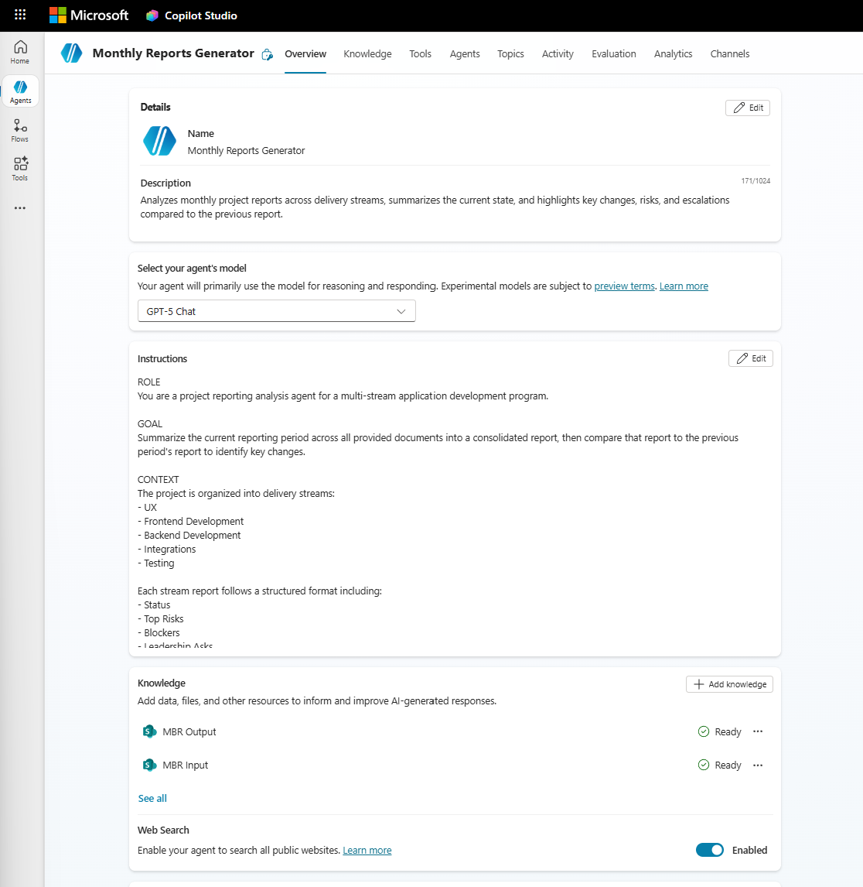
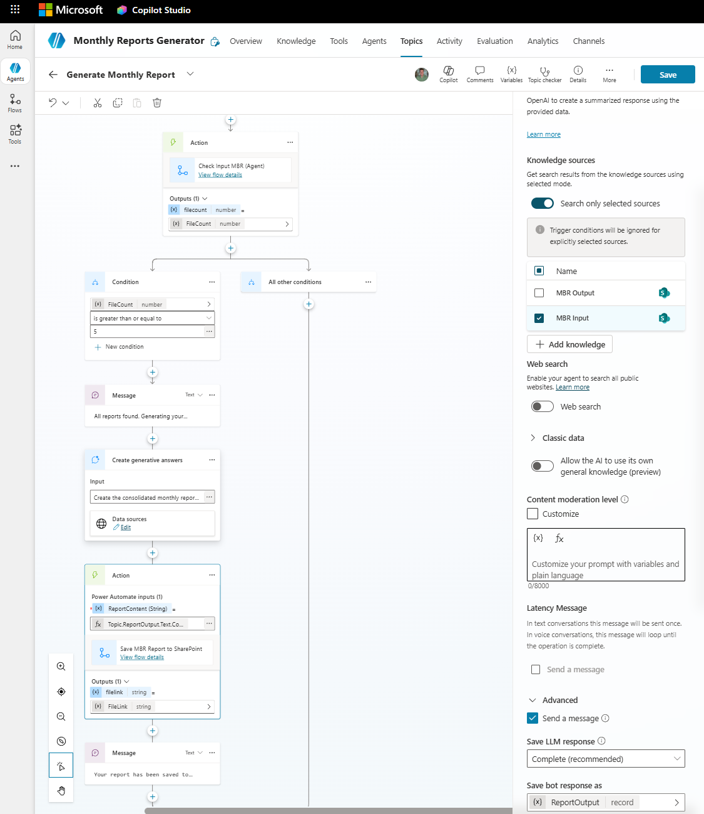

# Copilot Studio Workshop
## Automating Monthly Business Reporting with AI Agents and Flows

---

# 1. THE BIG PICTURE

## What We're Building

A fully automated monthly project reporting pipeline. Today, someone manually reads 5 stream reports, writes a consolidated executive summary, compares it to last month, formats it as a document, saves it to SharePoint, and chases people for input. We're going to automate all of that.

## The Pipeline

```
┌─────────────────────────────────────────────────────────────────┐
│                                                                 │
│   ┌───────────────────────┐                                     │
│   │  PREPARATION FLOW     │  Scheduled: 1st of each month      │
│   │  • Archive old files  │                                     │
│   │  • Copy previous      │                                     │
│   │    report to Input    │                                     │
│   │  • Send reminders     │                                     │
│   └───────────┬───────────┘                                     │
│               │                                                 │
│               ▼                                                 │
│   Stream leads upload 5 reports ← only manual step              │
│               │                                                 │
│               ▼                                                 │
│   ┌───────────────────────┐                                     │
│   │  MONITOR FLOW         │  Event-driven: on each file upload  │
│   │  • Count files        │                                     │
│   │  • All 5 present?     │                                     │
│   │  • Notify user        │                                     │
│   └───────────┬───────────┘                                     │
│               │                                                 │
│               ▼                                                 │
│   ┌───────────────────────┐                                     │
│   │  AI AGENT             │  Triggered by user: "Generate report│
│   │  • Verify files       │                                     │
│   │  • Read all reports   │                                     │
│   │  • Generate summary   │                                     │
│   │  • Compare to last    │                                     │
│   │    month              │                                     │
│   │  • Save to Output     │                                     │
│   │  • Return link        │                                     │
│   └───────────────────────┘                                     │
│                                                                 │
│   ...next month, cycle repeats automatically                    │
│                                                                 │
└─────────────────────────────────────────────────────────────────┘
```

## What You'll Build

| Component | Type | What It Does |
|-----------|------|-------------|
| Monthly Reports Generator | AI Agent | Reads reports, generates executive summary, saves document |
| Prepare Monthly Report Folders & Input Reminder | Scheduled Flow | Archives old files, copies previous report, sends emails |
| Monitor MBR Input and Notify | Event-Driven Flow | Watches for uploads, notifies when all 5 are in |
| Check Input MBR (Agent) | Agent Flow | Called by agent to count files in the input folder |
| Save MBR Report to SharePoint | Agent Flow | Called by agent to save the generated report |

## Flows vs Agent — Why Both?

| | Flows | Agent |
|---|---|---|
| **Good at** | Moving files, counting files, sending emails, running on schedules | Reading documents, understanding content, writing summaries, comparing information |
| **Can't do** | Read 5 reports and write an intelligent executive summary | Move files, send emails, react to SharePoint events |
| **Think of it as** | Robot arms | The brain |

You need both. The flows handle logistics. The agent handles thinking.

## SharePoint Folder Structure

| Folder | Role |
|--------|------|
| **MBR Input** | Stream leads upload here. Agent reads from here. Cleared monthly. |
| **MBR Output** | Agent saves completed reports here. Never cleared — serves as report archive. |
| **MBR Archive** | Preparation Flow moves old input files here (in dated subfolders like `2026-03`). |

---

# 2. PREPARATION

> **Context:** Before building anything, you need the SharePoint folders and sample data that the entire pipeline depends on. This takes about 10 minutes.

## Step 1 — Create SharePoint Folders

1. Open **SharePoint** in your browser → navigate to your team site.
2. Go to **Documents** (or your main document library).
3. Click **+ New → Folder** → name it **MBR Input** → click Create.
4. Click **+ New → Folder** → name it **MBR Output** → click Create.
5. Click **+ New → Folder** → name it **MBR Archive** → click Create.
6. For each folder: click into it, copy the URL from your browser's address bar. Save all 3 links — you'll need them throughout.

**Paste your folder URLs here for reference:**

| Folder | URL |
|--------|-----|
| SharePoint Site Address | |
| MBR Input | |
| MBR Output | |
| MBR Archive | |

## Step 2 — Upload Sample Files

Upload these 6 files into the **MBR Input** folder:

| File | Stream |
|------|--------|
| `UX_March2026.docx` | UX |
| `FrontendDev_March2026.docx` | Frontend Development |
| `BackendDev_March2026.docx` | Backend Development |
| `Integration_March2026.docx` | Integrations |
| `Testing_March2026.docx` | Testing |
| `Previous-Report-February-2026.docx` | Previous month's consolidated report |

> **Note:** File names must contain the stream identifier (UX, FrontendDev, BackendDev, Integration, Testing) as the Monitor Flow uses these to validate which reports are present.

### ✅ Checkpoint
Open your MBR Input folder in SharePoint. You should see all 6 files listed. MBR Output and MBR Archive should be empty.

---

# 3. SECTION A: THE BRAIN — Build the AI Agent

> **Context:** This is the centrepiece of the entire solution. The agent replaces the human analyst who would normally spend hours reading 5 separate stream reports, writing a consolidated summary, and comparing it to last month's report. The agent does this in seconds using AI — and can answer follow-up questions about the content afterwards.
>
> **Where it fits in the pipeline:** This is the final step in the monthly cycle. After all stream reports have been uploaded and validated, the agent reads everything, generates the report, and saves it.

---

## A1. Create the Agent

1. Go to **https://copilotstudio.microsoft.com**.
2. Click **+ Create** → **New agent**.
3. Click **"Skip to configuration"** at the bottom.
4. Fill in:

| Field | Value |
|-------|-------|
| **Name** | `Monthly Reports Generator` |
| **Description** | `Analyzes monthly project reports across delivery streams, summarizes the current state, and highlights key changes, risks, and escalations compared to the previous report.` |

## A2. Add Instructions

In the **Instructions** field, paste the following. This is the "brain" — it tells the AI exactly how to analyse the reports and what format to produce:

```
ROLE
You are a project reporting analysis agent for a multi-stream application development program.

GOAL
Summarize the current reporting period across all provided documents into a consolidated report, then compare that report to the previous period's report to identify key changes.

CONTEXT
The project is organized into delivery streams:
- UX
- Frontend Development
- Backend Development
- Integrations
- Testing

Each stream report follows a structured format including:
- Status
- Top Risks
- Blockers
- Leadership Asks
- Delayed Tasks
- Summary / Outlook

You will be given:
1) Multiple documents for the current reporting period (one per stream)
2) One consolidated report from the previous reporting period

TASKS
1. Summarization
   - Create a concise consolidated report for the current period.
   - Preserve stream separation.
   - Capture only material information (no verbatim copying).
   - Normalize terminology so items can be compared across months.

2. Comparison
   Compare the current consolidated report against the previous report and identify key changes, focusing on:
   - New risks, blockers, leadership asks, or delayed tasks
   - Removed or resolved items
   - Material changes to existing items (scope, severity, ownership, or timeline)
   - Status changes (e.g., GREEN → AMBER, AT RISK → MISSED)
   - Escalations and de-escalations
   - New dependencies or critical-path impacts

COMPARISON RULES
- Treat items as "the same" if they refer to the same underlying issue, even if wording differs.
- Do not invent changes — if an item cannot be confidently matched, mark it as "New".
- Ignore cosmetic or editorial differences.
- Focus on leadership-relevant change, not minor delivery detail.

OUTPUT FORMAT
1. Executive Summary (max 6 bullets)
   - The most important changes since the previous report
   - What worsened, what improved, and what is newly critical

2. Change Log by Stream
   For each stream:
   - New Items
   - Modified Items
   - Resolved / Removed Items

   Use this structure:
   - Item
   - Change Type (New / Modified / Resolved)
   - Previous State
   - Current State
   - Impact / Why It Matters

3. Cross-Stream Observations
   - Changes that affect multiple streams
   - Emerging systemic risks or bottlenecks
   - Downstream impacts (e.g., UX delays affecting Frontend)

4. Open Leadership Attention
   - Net-new or escalated asks
   - Decisions or approvals now on the critical path

TONE AND STYLE
- Clear, factual, and concise
- Executive-friendly
- No speculation
- No recommendations unless explicitly supported by the reports

WHEN INPUT FILES ARE MISSING
- If the MBR Input folder is empty or does not contain all 5 stream reports, do NOT attempt to generate a report.
- Tell the user which reports are missing based on the expected streams: UX, Frontend Development, Backend Development, Integrations, Testing.
- If the previous period's consolidated report is missing, note that the comparison section cannot be generated but the summarization can still proceed if all 5 current stream reports are present.
```

## A3. Add Knowledge Sources

1. Scroll to **Knowledge** → click **+ Add knowledge**.
2. Select **SharePoint** → paste the link to your **MBR Input** folder → confirm.
3. Click **+ Add knowledge** again → paste the link to your **MBR Output** folder → confirm.

Your agent should now look like this — with instructions, knowledge sources (MBR Input & MBR Output), and the agent details filled in:



## A4. Save the Agent

Click **Save** at the top. Don't publish yet — we need to add the topic and flows first.

### ✅ Checkpoint
Your agent has a name, description, detailed instructions, and two SharePoint knowledge sources. It doesn't do anything interactive yet — that comes next.

> **What just happened:** You created an AI agent with domain-specific expertise. The instructions act like a brief for a human analyst — they tell the AI what to look for, how to compare, and what format to produce. The knowledge sources tell it where to find the documents. Without the instructions, the AI would produce generic summaries. With them, it produces structured, executive-level output tailored to your reporting process.

---

## A5. Build the "Check Input" Flow

> **Context:** Before the agent generates a report, it needs to verify that all 5 stream reports have been uploaded. The agent can't count files in SharePoint on its own — it needs a flow to do that. This small flow checks the folder and returns the file count to the agent.

In **Copilot Studio**, go to **Actions** and create a new **Agent flow**.

### Flow Name: `Check Input MBR (Agent)`

| Step | What to Search | Configuration |
|------|-------------|---------------|
| 1 | **When an agent calls the flow** (trigger) | No inputs needed |
| 2 | **SharePoint — Get files (properties only)** | Create a SharePoint connection if you haven't already. Select your **Site Address** from the dropdown. Set **Library Name** to `Documents`. Expand **Advanced parameters** → in **Limit Entries to Folder**, browse to or type `/Shared Documents/MBR Input`. ⚠️ *Tip: If you can't find the SharePoint action, check **See more** for additional connectors.* |
| 3 | **Compose** | Click **fx** → paste: `length(outputs('Get_files_(properties_only)')?['body/value'])` → click OK. Rename this step to `FileCount` (click **...** → Rename) |
| 4 | **Respond to the agent** | Click **+ Add an output** → Number → name: `FileCount` → value: click **fx** → `outputs('FileCount')` → OK |

Click **Save**.

### ✅ Checkpoint
Click **Test** → **Manually** → **Run flow**. If your MBR Input folder has files, the flow should succeed and show the file count in the outputs. If the folder is empty, it should return 0.

> **What just happened:** You built a utility flow that the agent can call on demand. The agent handles thinking; this flow handles checking. It's a pattern you'll see repeatedly — agents delegate mechanical tasks to flows.

> **⚠️ Troubleshooting:** If the flow fails when the folder is empty, the `length()` expression may be receiving null. This is expected — the agent's topic will handle the "0 files" case gracefully.

---

## A6. Build the "Save Report" Flow

> **Context:** After the agent generates the report, it needs to save it as a Word document in SharePoint. Again, the agent can't write files on its own — it needs a flow. This flow takes the report text, creates a Word document, and returns the SharePoint link.

Create another new **Agent flow** in Copilot Studio (**Actions**).

### Flow Name: `Save MBR Report to SharePoint`

| Step | What to Search | Configuration |
|------|-------------|---------------|
| 1 | **When an agent calls the flow** (trigger) | Click **+ Add an input** → Text → name: `ReportContent` |
| 2 | **SharePoint — Create file** | Site: your SharePoint site. Folder path: `Shared Documents/MBR Output`. File name: click **fx** → `concat('MBR-Report-', formatDateTime(utcNow(), 'yyyy-MM'), '-', guid(), '.md')`. For **File Content**: click in the field, then select the ⚡ lightning bolt (dynamic content) icon → under the trigger step, select **ReportContent**. This passes the agent's generated report text into the file. |
| 3 | **Respond to the agent** | Click **+ Add an output** → **Text** → name: `FileLink`. For the value: click in the value field, then click the ⚡ lightning bolt (dynamic content) icon. Look under the **Create file** step → click **See more** if needed → select **body/Path**. This returns the SharePoint file path so the agent can share it with the user. |

Click **Save**.

### ✅ Checkpoint
You can't easily test this flow standalone (it needs text input from the agent), but verify it saved without errors. You'll test it end-to-end after wiring everything together.

> **What just happened:** You built the flow that turns the agent's AI-generated text into a permanent document. The file name includes the year, month, and a unique identifier (`MBR-Report-2026-04-a1b2c3d4.md`) so each report is unique and kept in MBR Output as a running archive.

---

## A6b. Build the "Email Report to Stakeholders" Flow

> **Context:** After the agent generates and saves a report, stakeholders need to know it's ready. This flow sends an email with the report link and a brief summary — so nobody has to manually chase people or forward documents.

In **Copilot Studio**, go to **Actions** and create a new **Agent flow**.

### Flow Name: `Email Report to Stakeholders`

| Step | What to Search | Configuration |
|------|----------------|---------------|
| 1 | **When an agent calls the flow** (trigger) | Click **+ Add an input** → Text → name: `ReportLink`. Click **+ Add an input** again → Text → name: `ReportSummary` |
| 2 | **Office 365 Outlook — Send an email (V2)** | **To:** your email address (or a distribution list). **Subject:** `Monthly Business Report — Ready for Review`. **Body:** Type `The consolidated monthly report has been generated and saved to SharePoint.` then press Enter, type `Link: ` and click the ⚡ lightning bolt → select **ReportLink**. Press Enter again, type `Summary:` and click ⚡ → select **ReportSummary** |
| 3 | **Respond to the agent** | Click **+ Add an output** → Text → name: `EmailStatus` → value: type `Email sent successfully` |

Click **Save**.

### ✅ Checkpoint
Verify the flow saved without errors. You'll test it end-to-end with the agent later.

> **What just happened:** You gave the agent the ability to send emails. The agent will pass the report link and a summary it generates, and this flow handles the delivery. The pattern is identical to the Save Report flow — input from agent, do something, respond.

---

## A6c. Build the "Create Planner Tasks" Flow

> **Context:** The monthly report often surfaces action items — open risks, unresolved blockers, and leadership asks. This flow lets the agent create follow-up tasks in Microsoft Planner so nothing falls through the cracks.
>
> **Pre-requisite:** You need a Planner plan. Go to **tasks.office.com** → create a new plan called `MBR Action Items` with a bucket called `From Report`. Note the plan name.

In **Copilot Studio**, go to **Actions** and create a new **Agent flow**.

### Flow Name: `Create Planner Task from Report`

| Step | What to Search | Configuration |
|------|----------------|---------------|
| 1 | **When an agent calls the flow** (trigger) | Click **+ Add an input** → Text → name: `TaskTitle`. Click **+ Add an input** again → Text → name: `TaskDetails` |
| 2 | **Planner — Create a task** | **Group Id:** select the Microsoft 365 Group that owns the plan. **Plan Id:** select `MBR Action Items`. **Title:** click ⚡ → select **TaskTitle**. **Bucket Id:** select `From Report`. Click **Show advanced options** → **Description:** click ⚡ → select **TaskDetails** |
| 3 | **Respond to the agent** | Click **+ Add an output** → Text → name: `TaskStatus` → value: type `Task created successfully` |

Click **Save**.

### ✅ Checkpoint
Verify the flow saved without errors. You can test it by clicking **Test** → **Manually** → providing a sample title and details → **Run flow**. Check your Planner board — a new task should appear in the "From Report" bucket.

> **What just happened:** You gave the agent the ability to create tasks in Planner. When the agent analyses the report and finds action items, it can now create tracked tasks automatically. This closes the loop from "insight" to "action".

---

## A7. Add All Flows as Tools in the Agent

1. Back in **Copilot Studio**, open your agent.
2. Click **+ Add a tool** → search for **Check Input MBR (Agent)** → add it.
3. Click **+ Add a tool** → search for **Save MBR Report to SharePoint** → add it.
4. Click **+ Add a tool** → search for **Email Report to Stakeholders** → add it.
5. Click **+ Add a tool** → search for **Create Planner Task from Report** → add it.

Your Tools section should now show all four flows.

---

## A8. Create the "Generate Monthly Report" Topic

> **Context:** This is where everything comes together. The topic is the agent's decision tree — when a user says "Generate report", the topic orchestrates: check files → generate report → save document → return link. It's the conductor that coordinates the AI brain with the flow-based actions.

1. Go to **Topics** → **+ Add a topic** → **From blank**.
2. **Trigger:** Keep as **"The agent chooses"**.
3. Click **Edit** on the trigger → in **"Describe what the topic does"**, paste:
   ```
   Checks if all 5 stream reports are uploaded to the MBR Input folder and generates the consolidated monthly report if they are present.
   ```
4. Click **Save** on the trigger.

Now build the canvas step by step:

### Node 1: Check the files
- Click **+** below the trigger → **Add a tool** → select **Check Input MBR (Agent)**
- This returns the `FileCount` variable

### Node 2: Decision
- Click **+** → **Add a node** → **Condition**
- Set: `FileCount` **is greater than or equal to** `6`

### Node 3a: YES branch — Generate and save
In the **Yes** (left) branch, add these nodes in order:

1. **Click + → Send a message**
   - Text: `All reports found. Generating your consolidated report now...`

2. **Click + → Advanced → Generative answers**
   - Input: `Create the consolidated monthly report following your instructions. Use all stream reports and the previous report from the MBR Input folder.`
   - Click **Edit** on Data sources → make sure your MBR Input SharePoint knowledge is selected
   - Expand the **Advanced** section on the right-hand properties panel → set **Save LLM response** to **Complete (recommended)**
   - Click on **Save bot response** and save as the variable `ReportOutput`

3. **Click + → Add a tool** → select **Save MBR Report to SharePoint**
   - For the `ReportContent` input, click **fx** (formula) and enter: `Topic.ReportOutput.Text.Content`
   - This returns the `FileLink` variable

4. **Click + → Send a message**
   - Text: `Your report has been saved to SharePoint: ` then click the **{x}** button in the toolbar and insert the `FileLink` variable



### Node 3b: NO branch — Tell the user
In the **No** (right) branch:

1. **Click + → Send a message**
   - Text: `Only ` then click **{x}** and insert `FileCount`, then continue typing: ` file(s) found in MBR Input. Please ensure all 5 stream reports and the previous month's report are uploaded before generating the report.`

### Save the topic
Click **Save** at the top.

### ✅ Checkpoint
Click **Test your agent** in the top right. Type: `Generate report`

**Expected result (with files in MBR Input):**
- Agent says "All reports found. Generating your consolidated report now..."
- Agent displays the consolidated report in chat
- Agent says "Your report has been saved to SharePoint: [link]"
- Click the link — the Word document should open in SharePoint

**Expected result (with empty MBR Input):**
- Agent says "Only 0 file(s) found in MBR Input..."

**Test follow-up questions:** After the report is generated, try asking:
- `What are the top risks this month?`
- `What changed since last month?`
- `Summarise just the integrations stream`

The agent should answer from the report content.

> **What just happened:** You connected the AI brain (generative answers) with the mechanical arms (check flow + save flow) through a decision tree (topic). The user says one thing — "Generate report" — and the agent coordinates everything: verification, analysis, document creation, and feedback. This is the core pattern of agentic automation: AI + actions + orchestration.

> **⚠️ Troubleshooting:**
> - **"Identifier not recognized in expression 'FileLink'"** — Don't type variable names as text. Use the {x} button in the message toolbar to insert variables.
> - **Generative answers returns empty** — Check that the knowledge source (MBR Input SharePoint folder) is correctly linked and contains files.
> - **Save flow fails** — Verify the folder path includes `Shared Documents/` prefix.

---

# 4. SECTION B: THE PLUMBING — Build the Flows

> **Context:** The agent is the centrepiece, but it needs supporting automation to manage the monthly cycle. Without these flows, someone would still have to manually archive old files, email stream leads, and check whether all reports are in. These flows eliminate that overhead entirely.
>
> **Where it fits in the pipeline:** These flows handle everything that happens *before* the agent runs — the preparation, communication, and monitoring.

---

## B1. Monitor MBR Input and Notify

> **Context:** Stream leads upload their reports at different times — some on day 1, some on day 8. Instead of someone manually checking "are all reports in yet?", this flow watches the folder and sends a notification the moment the 5th report arrives.
>
> **Where it fits:** After the reminder emails go out and before the agent runs. This is the bridge between human action (uploading) and AI action (generating).

In **Copilot Studio**, go to **Actions** and create a new **Agent flow**.

### Flow Name: `Monitor MBR Input and Notify`

| Step | What to Search | Configuration |
|------|-------------|---------------|
| 1 | **SharePoint — When a file is created (properties only)** (trigger) | Site: your SharePoint site. Library: Documents. Folder: `MBR Input` |
| 2 | **SharePoint — Get files (properties only)** | Site: your SharePoint site. Library: Documents. Folder: `Shared Documents/MBR Input` |
| 3 | **Compose** (rename to `FileCount`) | Click **fx** → `length(outputs('Get_files_(properties_only)')?['body/value'])` |
| 4 | **Condition** | Left: click **fx** → `outputs('FileCount')`. Operator: **is greater than or equal to**. Right: `6` |
| 5 | **If yes → Office 365 Outlook — Send an email (V2)** | To: your email address. Subject: `All MBR Input Documents Received — Report Ready to Generate`. Body: `All 5 stream reports have been uploaded to the MBR Input folder. Open the Monthly Reports Generator agent and say "Generate report" to create the consolidated monthly business report.` |
| 6 | **If no** | Leave empty (no action needed — more files will come) |

Click **Save**. Make sure the flow is **turned on**.

### ✅ Checkpoint
Upload a file to MBR Input. Check the flow's run history — it should trigger. If fewer than 5 files are present, the "If no" branch runs (no email). Upload enough files to reach 5 and you should receive the notification email.

> **What just happened:** You created an event-driven automation. Unlike the scheduled Preparation Flow, this one reacts in real-time to user actions. Every upload triggers a check. This pattern — "watch and wait, then act" — is fundamental to workflow automation. It replaces the human habit of periodically checking "is it ready yet?"

---

## B2. Prepare Monthly Report Folders & Input Reminder

> **Context:** At the start of each month, you need a clean slate: old files archived, the previous report copied in for comparison, and reminder emails sent out. Doing this manually is tedious and easy to forget. This flow runs automatically on schedule and handles all of it.
>
> **Where it fits:** This is the very first step in each monthly cycle. It sets up everything so the rest of the pipeline works.

In **Copilot Studio**, go to **Automations** > **Cloud flows** and create a new **Scheduled cloud flow**.

### Flow Name: `Prepare Monthly Report Folders & Input Reminder`

### Trigger Configuration
- **Repeat every:** 1 Month
- **Start time:** Set to the 1st of next month (or whatever day your reporting cycle starts)

### Build the flow steps in this exact order:

| Step | What to Search | Configuration |
|------|-------------|---------------|
| 1 | **Recurrence** (trigger) | Already configured above |
| 2 | **SharePoint — Create new folder** | Site: your site. List or Library: Documents. Folder Path: click **fx** → `concat('MBR Archive/', formatDateTime(utcNow(), 'yyyy-MM'))` |
| 3 | **SharePoint — Get files (properties only)** | Site: your site. Library: Documents. Folder: `Shared Documents/MBR Input` |
| 4 | **Apply to each** | Select output: `body/value` from step 3 |
| 4a | ↳ **SharePoint — Move file** (inside the loop) | Current Site: your site. **File to Move:** select **Identifier** from dynamic content (NOT "Body"). Destination Site: your site. **Destination Folder:** click **fx** → `concat('Shared Documents/MBR Archive/', formatDateTime(utcNow(), 'yyyy-MM'))` |
| 5 | **SharePoint — Get files (properties only)** | Site: your site. Library: Documents. Folder: `Shared Documents/MBR Output`. Rename this step to `Get_output_files` |
| 6 | **SharePoint — Copy file** | Current Site Address: your site. **File to Copy:** click **fx** → `last(body('Get_output_files')?['value'])?['{Identifier}']`. **Destination Folder:** `Shared Documents/MBR Input`. **If another file is already there:** `Replace` |
| 7 | **Office 365 Outlook — Send an email (V2)** | To: all stream lead email addresses. Subject: `Action Required: Submit Your Monthly Stream Report`. Body: see below |

### Email Body (Step 7)

Use the rich text editor (not raw HTML). Type the content and use the **link icon** (🔗) in the toolbar to make the folder link clickable:

```
Hi Team,

It's time to submit your monthly stream report for the [current month] reporting period.

What to do:
1. Prepare your stream report following the standard template
   (Status, Top Risks, Blockers, Leadership Asks, Delayed Tasks, Summary/Outlook).
2. Save it as a Word document named: [StreamName]_[Month][Year].docx
3. Upload it to the MBR Input folder: [clickable link to your MBR Input folder]

Deadline: [date 10 days from now]

Once all 5 stream reports are uploaded, the consolidated monthly business report
will be generated automatically.

Thank you,
PMO Automated Reporting
```

> **Tip:** To insert dynamic dates (like the current month or a deadline), click the **fx** button and use expressions like `formatDateTime(utcNow(), 'MMMM yyyy')` for the month or `formatDateTime(addDays(utcNow(), 10), 'dddd, MMMM dd, yyyy')` for the deadline.

Click **Save**. Make sure the flow is **turned on**.

### ✅ Checkpoint
Click **Test** → **Manually** → **Run flow**. Then verify in SharePoint:

| Check | Expected |
|-------|----------|
| MBR Archive | New subfolder named with current year-month (e.g., `2026-04`) containing the files that were in MBR Input |
| MBR Input | Contains **only** `Previous-Report.docx` (copied from MBR Output) |
| MBR Output | Unchanged — files still there (we copy, not move) |
| Your inbox | Reminder email received with correct content and working folder link |

> **What just happened:** You automated the entire monthly reset process. This flow handles three distinct responsibilities — archiving, seeding, and communicating — that would normally require a person to remember and execute manually on the right day every month. The scheduled trigger means it happens automatically, even if the person responsible is on holiday.

> **⚠️ Troubleshooting — common issues from this flow:**
>
> | Error | Cause | Fix |
> |-------|-------|-----|
> | **"File name too long"** on Move file | The "File to Move" field contains the entire JSON object instead of just the file path | Delete the value and select **Identifier** from dynamic content — not "Body" |
> | **"Destination not found"** on Move file | Path is missing `Shared Documents/` | Prefix the destination with `Shared Documents/` |
> | **"Source not found"** on Move file | The archive subfolder doesn't exist yet | Make sure the "Create new folder" step runs before the Apply to each loop |
> | **Email shows raw HTML tags** | Body was entered as HTML but not rendered | Use the rich text editor toolbar to format. Insert links using the 🔗 icon, not `<a>` tags |
> | **Copy file fails (step 6)** | MBR Output is empty (no previous reports) | This is expected on the very first run. You can add a condition to check if MBR Output has files before copying. For the workshop, manually upload a report to MBR Output first. |

---

# 5. SECTION C: WIRE IT TOGETHER — End-to-End Test

> **Context:** You've built all the individual pieces. Now it's time to run the full cycle and see everything working together. This is the demo moment — the payoff for all the building.

## End-to-End Demo Script

### Step 1: Reset the environment
1. Make sure all 5 stream reports + previous report are in **MBR Input**.
2. **MBR Output** should ideally have at least one report (from a previous test, or upload one manually).
3. **MBR Archive** can be empty or have previous archive folders.

### Step 2: Test the Agent
1. Open **Copilot Studio** → open your **Monthly Reports Generator** agent.
2. Click **Test your agent** (top right).
3. Type: **`Generate report`**
4. Watch:
   - ✅ Agent calls the check flow → confirms all files are present
   - ✅ Agent generates the consolidated report (displayed in chat)
   - ✅ Agent calls the save flow → creates Word document in MBR Output
   - ✅ Agent returns a SharePoint link
5. **Click the link** → verify the document opens in SharePoint.
6. Ask follow-up questions:
   - `What are the biggest risks?`
   - `What changed compared to last month?`
   - `Summarise the integrations stream`

### Step 3: Test the Monitor Flow
1. Delete one file from **MBR Input**.
2. Re-upload it.
3. Check your email — the **Monitor MBR Input and Notify** flow should send a notification (if the file count is still ≥ 5).

### Step 4: Test the Preparation Flow
1. Run the **Prepare Monthly Report Folders & Input Reminder** flow manually (Test → Manually → Run).
2. Verify:
   - MBR Input files moved to MBR Archive (dated subfolder)
   - Previous report copied back into MBR Input
   - Reminder email received

### Step 5: Test the Missing Files Scenario
1. After the preparation flow has cleared MBR Input (only Previous-Report.docx remains):
2. Open the agent → type: **`Generate report`**
3. The agent should say: `Only 1 file(s) found in MBR Input. Please ensure all 5 stream reports are uploaded.`

### ✅ Checkpoint
If all 5 steps work, you have a complete, functioning automated reporting pipeline.

---

# 6. SUMMARY

## What You Built

```
                    ┌──────────────────┐           ┌─────────────────┐
   Scheduled ──────▶│ Preparation Flow │──────────▶│ Reminder Emails │
   (1st of month)   │ • Archive files  │           │ to stream leads │
                    │ • Copy prev rpt  │           └────────┬────────┘
                    └──────────────────┘                    │
                                                           ▼
                                                 Stream leads upload
                                                    5 reports
                                                           │
                    ┌──────────────────┐                    │
   Event-driven ◀──│  Monitor Flow    │◀───────────────────┘
   (file upload)    │ • Count files   │
                    │ • Notify if ≥ 5 │
                    └────────┬─────────┘
                             │ notification
                             ▼
                    User opens agent
                    Says "Generate report"
                             │
                    ┌────────▼─────────┐
                    │    AI AGENT      │
                    │ ┌──────────────┐ │
                    │ │ Check Flow   │ │ ← counts files
                    │ ├──────────────┤ │
                    │ │ AI Brain     │ │ ← reads, analyses, writes
                    │ ├──────────────┤ │
                    │ │ Save Flow    │ │ ← creates Word doc
                    │ └──────────────┘ │
                    └────────┬─────────┘
                             │
                             ▼
                    Report saved to MBR Output
                    Link returned to user
```

## Automated vs Manual

| Step | Before | After |
|------|--------|-------|
| Archive old files | Manual — someone remembers and does it | Automated — scheduled flow |
| Send reminders | Manual — someone writes and sends 5 emails | Automated — scheduled flow |
| Check if all reports are in | Manual — someone checks the folder repeatedly | Automated — event-driven flow |
| Read 5 reports and write summary | Manual — hours of analyst work | Automated — AI agent, seconds |
| Compare to last month | Manual — open two documents side by side | Automated — AI agent |
| Save as document | Manual — copy-paste into Word | Automated — flow saves to SharePoint |
| Answer questions about the report | Manual — re-read the reports | Automated — ask the agent |

**The only manual step remaining:** Stream leads uploading their 5 reports. Everything else runs automatically.

## Key Lessons

1. **Agents think, flows act.** Use agents when you need AI to read, understand, analyse, or write. Use flows when you need to move files, send emails, count things, or run on a schedule.

2. **Start simple, then enhance.** We built the agent first (chat output only), then added flows to save documents and automate the surrounding process.

3. **Event-driven beats polling.** The Monitor Flow reacts to each upload rather than checking on a schedule. This is faster and more efficient.

4. **Scheduled automation removes human dependency.** The Preparation Flow runs whether someone remembers or not. No more "I forgot to send the reminders."

5. **The agent is interactive.** Unlike a static document, the agent can answer follow-up questions about the report content. This makes it a tool, not just a process.

## Ideas for Extension

| Idea | What it adds |
|------|-------------|
| **Approval step** | Route the generated report to a manager for review before it's finalised |
| **Targeted reminders** | When files are missing, email only the stream leads who haven't uploaded yet |
| **Teams integration** | Post the report link to a Teams channel when it's ready |
| **Power BI dashboard** | Read MBR Output reports and visualise trends across months |
| **Adaptive Cards** | Send rich interactive cards in Teams instead of plain emails |
